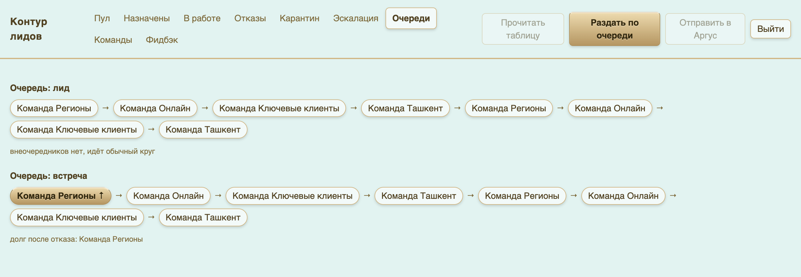

# Как устроен процесс целиком

## Путь одной компании

```
Лидоген в Битриксе нашёл компанию
        │
        ▼
строка в таблице лидогенерации (тип, компания, ID компании в Б24, направление, исполнитель)
        │  контур читает таблицу раз в минуту
        ▼
контур тянет карточку компании из Битрикса (название, ИНН, ОКЭД, контакты)
        │
        ▼
очередь выбирает команду — строго по кругу, без ручного вмешательства
        │
        ▼
компания заводится в Аргусе на ответственного этой команды
        │
        ├──► в таблицу напротив строки встаёт «назначено»
        └──► в телеграм команде улетает уведомление со ссылками на карточки
        │
        ▼
менеджер работает с компанией и ставит в СРМ результат
        │
        ├──► «в работе»  — цикл закрыт, всё хорошо
        └──► «отказ»     — лид негодный: компания снимается с команды,
                           а команде записывается долг — следующую компанию
                           она получит вне очереди
```

## Очередь

Компании раздаются по кругу: команда 1 → 2 → 3 → 4 → 1 → … Порядок задаёт руководитель.

Две очереди идут независимо: **лиды** и **встречи**. Лид, ушедший в первую команду,
никак не сдвигает очередь встреч.

**Отказ = долг.** Если менеджер отметил «отказ», команда получила пустышку вместо своего хода.
Контур помнит это и выдаёт ей следующую компанию вне очереди, не сдвигая круг для остальных.
Когда долг погашен, в таблице напротив той самой отказной строки встаёт галочка «Долг закрыт».



## Статусы

| В таблице | В интерфейсе | Что означает | Кто ставит |
|---|---|---|---|
| пусто | **Пул** | строка прочитана, ждёт распределения | — |
| `назначено` | **Назначены** | компания отдана команде, ждём реакции | контур |
| `в работе` | **В работе** | менеджер взял компанию — цикл закрыт | менеджер / СРМ |
| `отказ` | **Отказы** | лид негодный, команде записан долг | менеджер / СРМ |
| — | **Карантин** | строка не прошла проверку: нет компании, нет ID, дубль | контур |
| — | **Эскалация** | отдавать некому или нет ИНН — вопрос к руководителю | контур |

Статус в таблице и статус в интерфейсе — это одно и то же, просто в двух окнах.
Таблица — двусторонний канал: контур пишет в неё «назначено», а «в работе» и «отказ»
приезжают из СРМ обратно в контур.

## Кто что видит

| | Таблица | Телеграм-бот | Интерфейс контура |
|---|---|---|---|
| Лидоген | ✅ пишет и читает статусы | — | — |
| Менеджер | — | ✅ уведомления + фидбэк | — |
| Руководитель | ✅ читает | ✅ уведомления по своей команде | ✅ полный доступ |

## Что делать, если что-то пошло не так

| Симптом | Кто чинит | Как |
|---|---|---|
| строка висит в таблице без статуса больше часа | руководитель | вкладка «Карантин» — там причина |
| компания не появилась в Аргусе | руководитель | вкладка «Эскалация» — там текст ошибки |
| уведомление не пришло | сам менеджер | написать боту «Старт» и прислать свой ID из Аргуса |
| лид негодный | менеджер | отметить «отказ» в СРМ + фидбэк через бота |
