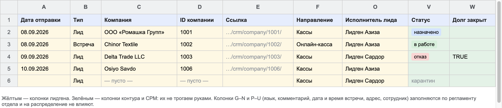
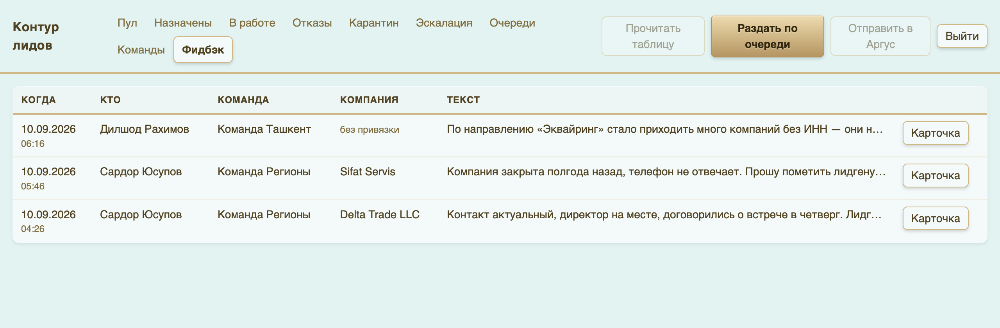

# Инструкция: отдел лидогенерации

Ваша задача — довести компанию из Битрикса до строки в таблице так, чтобы контур смог
её разобрать. Дальше всё происходит само: распределение, заведение в Аргусе, уведомление
менеджеру. Вы только видите в своей же таблице, что с компанией стало.

---

## 1. Что вы заполняете

Жёлтым — ваши колонки. Зелёным — колонки контура и СРМ, **их руками не трогаем**.

### Обязательный минимум

| Колонка | Что писать | Почему это критично |
|---|---|---|
| **B — Тип** | ровно `Лид` или `Встреча` | это разные очереди; другое слово → строка в карантин |
| **C — Компания** | название компании | по нему компанию узнают в интерфейсе и уведомлении |
| **D — ID компании** | номер карточки в Битриксе | по нему контур тянет ИНН, ОКЭД и контакты. **Без него строка не поедет** |
| **O — Исполнитель лида** | ваше имя / позывной | по нему потом видно, чей лид сработал, а чей нет |

Остальные колонки (A — дата отправки, E — ссылка, F — направление, G–N, P–U — язык директора,
комментарий, дата и время встречи, адрес, сотрудник) заполняются по регламенту отдела.
На распределение они не влияют, но менеджер их читает — заполняйте по-человечески.

### Где взять ID компании

Откройте карточку компании в Битриксе. Номер в адресе страницы —
`…/crm/company/details/**1001**/` — это и есть ID. Его же удобно вставить в колонку E ссылкой целиком.

---

## 2. Три правила, из-за которых чаще всего ломается

**Правило 1. Тип пишем словом из списка.** `Лид` или `Встреча`. Не «лидик», не «ЛИД »
с пробелом в конце (пробелы и регистр контур прощает), не пусто. Пусто или чужое слово —
строка уходит в карантин и никому не назначается.

**Правило 2. У компании в Битриксе должен быть заполнен ИНН.** Аргус не принимает компанию
без ИНН — такая строка честно падает в «Эскалацию» и ждёт, пока кто-то руками разберётся.
Проверьте ИНН в карточке Б24 **до** отправки, это тридцать секунд.

**Правило 3. Одна компания — одна строка.** Дубль по телефону, почте или названию контур
поймает и отправит в карантин. Если компанию нужно передать повторно (прошло полгода,
ситуация изменилась) — скажите руководителю, он проведёт её вручную.

---

## 3. Что происходит после того, как вы заполнили строку

Контур читает таблицу **раз в минуту**. Дальше:

1. Тянет карточку компании из Битрикса по ID.
2. Выбирает команду по очереди.
3. Заводит компанию в Аргусе.
4. Ставит вам в колонку **V — Статус** слово `назначено`.

Если через несколько минут в колонке V пусто — что-то не сошлось. Не переписывайте строку
заново: покажите её руководителю, он посмотрит в «Карантине» и «Эскалации» точную причину.

---

## 4. Как читать статус в своей таблице

| Что вы видите в колонке V | Что это значит для вас |
|---|---|
| пусто (первые минуты) | строка ещё не прочитана — подождите |
| `назначено` | компания ушла в команду, ждём реакцию менеджера |
| `в работе` | **ваш лид засчитан** — менеджер взял компанию |
| `отказ` | лид признан негодным: компания закрыта, контакт не тот, дубль |
| пусто дольше часа | строка не прошла проверку — к руководителю |

Колонка **W — Долг закрыт** заполняется контуром сама, вас она не касается — это внутренний
учёт по командам.

---

## 5. Что делать с отказами

Отказ — не наказание, а сигнал. По каждому отказу менеджер обычно пишет фидбэк:
что именно было не так с компанией. Этот фидбэк видит руководитель в интерфейсе контура.

Раз в неделю имеет смысл разобрать отказы вместе с руководителем: если по одному направлению
их много, значит проблема в источнике, а не в конкретной компании.

---

## Чек-лист перед отправкой

- [ ] В карточке Б24 заполнен **ИНН**
- [ ] Колонка **B** — ровно `Лид` или `Встреча`
- [ ] Колонка **C** — название компании
- [ ] Колонка **D** — ID компании из Битрикса
- [ ] Колонка **O** — ваше имя
- [ ] Колонки **V** и **W** — **не трогали**
