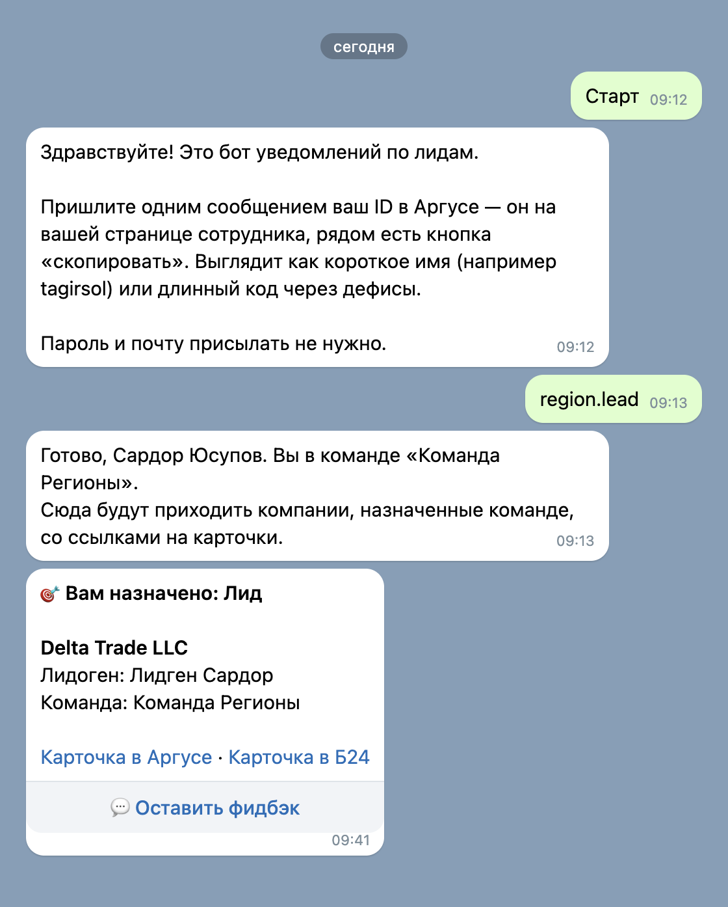
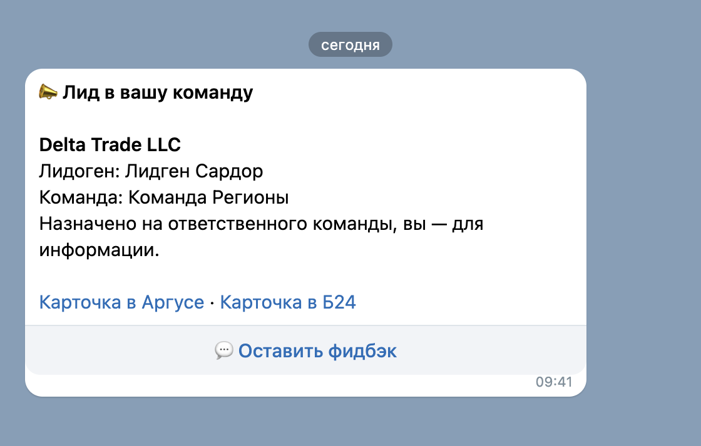
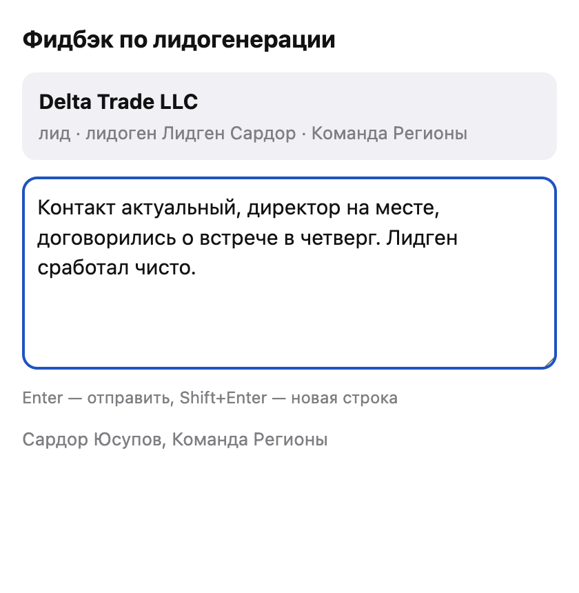

# Инструкция: менеджер

Вы получаете компании, которые контур раздал вашей команде. Всё приходит в телеграм —
отдельно заходить куда-то и что-то проверять не нужно.

---

## 1. Подключиться к боту — один раз

Телеграм не разрешает ботам писать первыми, поэтому первый шаг всегда за вами.

1. Откройте **@lidgen_CP_bot** и нажмите **«Старт»**.
2. Бот попросит ваш **ID в Аргусе**. Откройте свою страницу сотрудника в Аргусе, там рядом
   с ID есть кнопка «скопировать». Выглядит как короткое имя (`tagirsol`) или длинный код через дефисы.
3. Пришлите этот ID одним сообщением.

**Пароль и почту присылать не нужно** — бот их не спрашивает и никогда не спросит.

Если бот отвечает «такого ID в списке команд нет» — вы прислали не то поле (почту вместо ID)
либо вас ещё не добавили в команду. Напишите руководителю.

---

## 2. Как приходит компания

Уведомление приходит сразу после того, как компания заведена в Аргусе.

**Если компания заведена на вас** — заголовок «🎯 Вам назначено».
**Если на коллегу по команде** — «📣 Лид в вашу команду», вы получаете его для информации.

В сообщении:
- название компании и вид (лид или встреча);
- кто из лидгена её прислал;
- ваша команда;
- **ссылки на карточку в Аргусе и в Битриксе** — открывается в один клик, искать вручную не нужно;
- кнопка **«💬 Оставить фидбэк»**.

---

## 3. Что делать дальше

1. Откройте карточку в Аргусе по ссылке из уведомления.
2. Отработайте компанию как обычно.
3. **Поставьте результат в СРМ** — это обязательный шаг:
   - **«в работе» / «принято»** — компания годная, вы её взяли;
   - **«отказ»** — лид негодный.

Статус из СРМ сам уезжает обратно в таблицу лидогенерации и в контур. Ничего дополнительно
отмечать не надо.

> Отметить результат может **любой** участник команды, не только тот, на кого заведена компания.
> Контур смотрит на статус, а не на то, чьими руками он поставлен.

### Когда ставить «отказ»

Отказ — это про качество лида, а не про «мне сейчас некогда»:
компания закрыта, телефон не отвечает и не отвечал, не тот профиль деятельности,
дубль уже работающего клиента, контактное лицо не имеет отношения к компании.

Отказ не наказывает вашу команду — наоборот: контур запомнит, что вы получили пустышку,
и выдаст следующую компанию **вне очереди**. Поэтому честный отказ выгоднее, чем молча
оставить компанию висеть.

**«Некогда взять в работу» — это не отказ.** Такую компанию просто отработайте позже:
она остаётся за командой.

---

## 4. Фидбэк по лиду

Кнопка **«💬 Оставить фидбэк»** под уведомлением открывает форму прямо в телеграме.
Компания уже подставлена — писать, о ком речь, не нужно.

- Enter — отправить, Shift+Enter — новая строка.
- Кто пишет, бот знает сам — подписываться не нужно.
- Фидбэк видит руководитель в интерфейсе контура.

**О чём писать:** что было не так с компанией (закрыта, не тот профиль, контакт не тот),
или наоборот — что лид пришёл чистый и сработал. Это единственный канал, по которому
лидген узнаёт, что он делает правильно, а что нет.

**Свободный фидбэк.** Можно написать боту и без привязки к компании — например, про целое
направление. Если вставите в текст ссылку на карточку компании, контур сам подтянет её
в карточку фидбэка.

---

## 5. Частые вопросы

**Уведомления не приходят.** Вы не нажали «Старт» у бота или не прислали ID.
Пройдите шаг 1 заново. Если писали давно и всё равно тихо — скажите руководителю,
он проверит вашу привязку в карточке команды.

**Пришла компания, которая уже есть у нас в работе.** Отметьте «отказ» и напишите фидбэк
с пометкой «дубль» — так лидген увидит источник проблемы.

**Я в отпуске.** Скажите руководителю: он отметит вас неактивным, и уведомления перестанут
приходить, а назначения уйдут на коллегу.

**Ушёл не тот человек в отпуск / сменился ответственный.** Это правится руководителем
в карточке команды за десять секунд, вам делать ничего не нужно.
