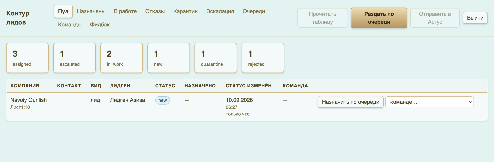
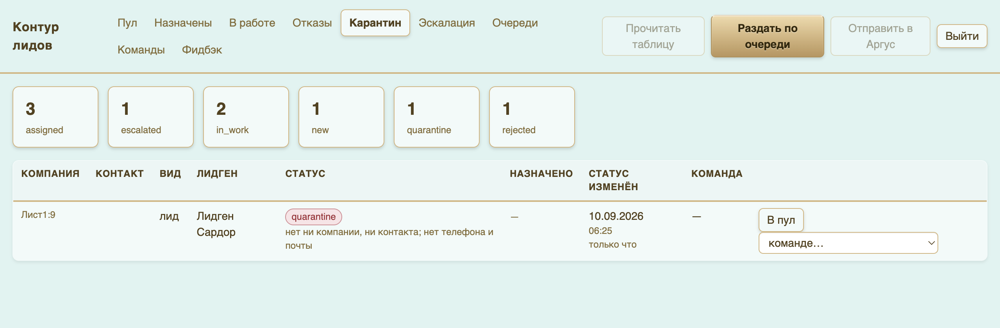
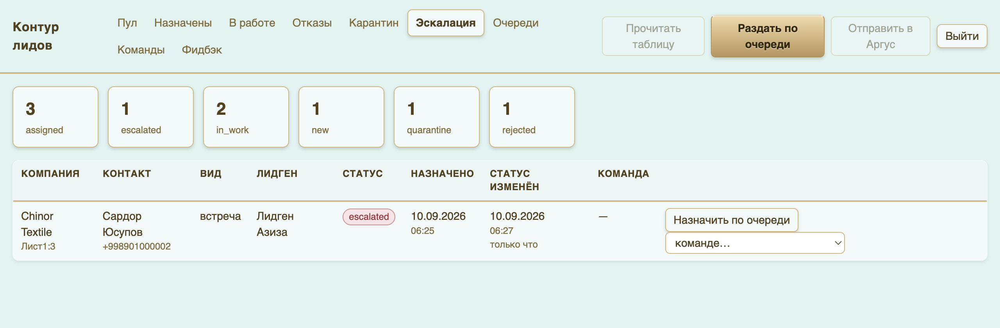
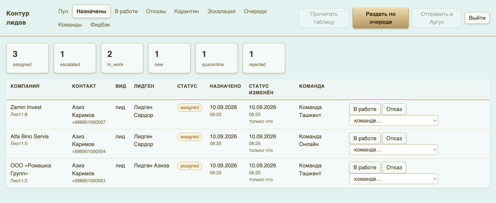
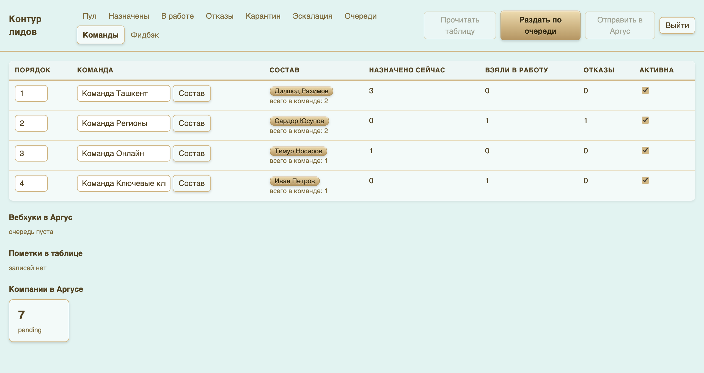
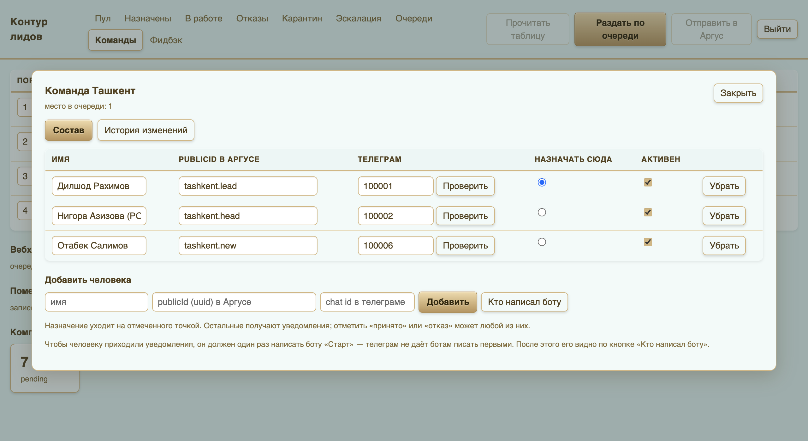
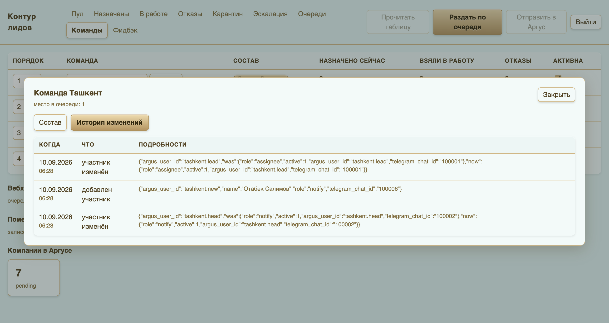
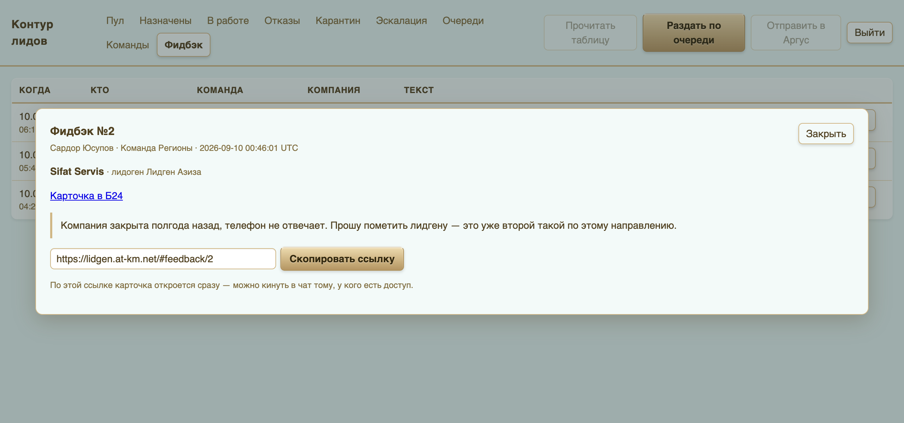
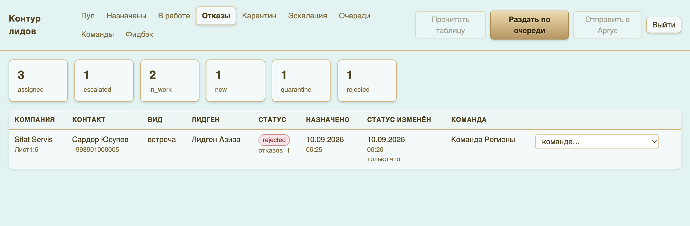

# Инструкция: руководитель

Интерфейс контура: **https://lidgen.at-km.net** — логин и пароль выдаются отдельно.
Здесь видно всё: где какая компания, кто следующий в очереди, что сломалось и что пишут менеджеры.

Вверху — вкладки по состояниям, справа — три кнопки ручного запуска:
**«Прочитать таблицу»**, **«Раздать по очереди»**, **«Отправить в Аргус»**.
Всё это контур делает сам раз в минуту — кнопки нужны, когда не хочется ждать.

---

## 1. Ежедневный обход — три минуты

Порядок такой: сначала смотрим, что сломалось, потом что залежалось, потом что пишут люди.

### Карантин — строки, которые контур не понял

По каждой строке написана точная причина: нет компании, нет ID, дубль по телефону,
неизвестный тип лида. Лечится в таблице руками лидгена — покажите ему строку.

### Эскалация — отдавать некому

Сюда падает то, что контур не смог довести до конца:
- у компании нет ИНН — Аргус её не примет;
- ни одной активной команды;
- Битрикс или Аргус не ответили пять раз подряд.

Причина написана текстом. После того как причина устранена, компанию можно вернуть в круг
кнопкой на строке.

### Назначены — что висит без реакции

Колонка **«Статус изменён»** показывает, сколько компания висит в текущем состоянии.
Всё, что висит **дольше суток, подсвечивается красным** — это компании, по которым
менеджер не поставил результат. Один звонок обычно закрывает вопрос.

Здесь же можно вмешаться руками: **«В работе»**, **«Отказ»** или передать другой команде
через выпадающий список.

---

## 2. Очередь и долги

Вкладка **«Очереди»** показывает цепочку: кто получит следующую компанию, кто за ним.
Две очереди — по лидам и по встречам — идут независимо.

**Подсвеченная команда со стрелкой ↑ — внеочередник.** Она получила отказ и теперь
имеет право на компанию вне круга. Долги гасятся в порядке поступления, круговой курсор
при этом не двигается — команда, стоявшая следующей, свой ход не теряет.

Строчка внизу прямо говорит, что происходит: «внеочередников нет, идёт обычный круг»
или «долг после отказа: Команда Регионы».

---

## 3. Команды и люди

Вкладка **«Команды»**: порядок в очереди, название, состав, счётчики (назначено сейчас /
взяли в работу / отказы) и выключатель активности.

- **Порядок** — поле слева, правится прямо в списке.
- **Название** — правится там же.
- **Активна** — снятая галочка означает, что команде перестают приходить компании.
  Так закрывают команду на время отпуска или переформирования.

### Карточка команды

Клик по кнопке **«Состав»** открывает карточку.

| Поле | Что это |
|---|---|
| **Имя** | как человека называть, для вашего же удобства |
| **publicId в Аргусе** | по нему бот узнаёт человека и по нему компания заводится в Аргусе |
| **Телеграм** | chat id; заполняется сам, когда человек напишет боту свой ID |
| **Назначать сюда** | точка — **получатель**: на него заводится компания в Аргусе |
| **Активен** | снятая галочка = человек не получает уведомления и не может быть получателем |

**Получатель в команде всегда один.** Отметили нового — с прежнего роль снимается
автоматически, он остаётся на уведомлениях.

**Если в команде никто не отмечен получателем**, компания останется назначенной,
но в Аргус не уедет — в интерфейсе будет видно причину.

### Как подключить человека к боту

1. Человек открывает **@lidgen_CP_bot** и жмёт «Старт».
2. Присылает боту свой **ID из Аргуса** — бот сам находит его в составе команды и привязывает.
3. Готово. Ничего переносить руками не нужно.

Если человек написал боту, но не привязался — кнопка **«Кто написал боту»** покажет всех,
кто нажимал «Старт», их chat id и к кому они привязаны. Оттуда chat id можно вставить в карточку вручную.

Кнопка **«Проверить»** рядом с chat id отправляет человеку тестовое сообщение — быстрый способ
убедиться, что канал живой.

### История изменений

Вкладка **«История изменений»** в карточке: кто когда добавлен, у кого забрали назначение,
как менялся порядок. Пишется на каждую правку — задним числом ничего не пропадает.

---

## 4. Фидбэк от менеджеров

Менеджеры пишут фидбэк кнопкой под уведомлением. Здесь он копится: кто, когда,
по какой компании, из какой команды.

Клик по тексту открывает карточку.

В карточке — ссылки на карточку компании в Битриксе и Аргусе и **постоянная ссылка на сам
фидбэк**: её можно скинуть в чат тому, у кого есть доступ, — карточка откроется сразу.

Если в тексте фидбэка есть ссылка на компанию, контур сам подтянет её карточку —
даже если фидбэк был написан без привязки.

**Что с этим делать.** Раз в неделю пройтись по фидбэку вместе с лидгеном. Один отказ —
случайность. Три отказа по одному направлению — проблема в источнике, и это разговор
про источник, а не про менеджеров.

---

## 5. Отказы

Отдельная вкладка: компании, признанные негодными. Компания снята с команды и дальше
по кругу не идёт. Команде записан долг — следующую компанию она получит вне очереди.

Смотрите на распределение отказов по лидгенам: колонка «Лидген» показывает, чья это была компания.

---

## 6. Ручные кнопки — когда они нужны

| Кнопка | Что делает | Когда жать |
|---|---|---|
| **Прочитать таблицу** | опросить таблицу немедленно | лидген только что добавил строку, ждать минуту не хочется |
| **Раздать по очереди** | разобрать пул | после того как починили строку в карантине |
| **Отправить в Аргус** | дослать компании, которые не уехали | после того как назначили получателя команде |

Ничего из этого не ломается от лишнего нажатия: контур не задваивает компании
и не назначает то, что уже назначено.

---

## Что держать в голове

- Раздача идёт сама. Ручное вмешательство — это починка, а не рутина.
- Красная подсветка на вкладке «Назначены» — единственная метрика, которую стоит смотреть ежедневно.
- Карантин — вопрос к лидгену. Эскалация — вопрос к вам или к интеграциям.
- Отказ не наказывает команду, а даёт ей внеочередной ход. Поэтому честные отказы выгодны всем.
